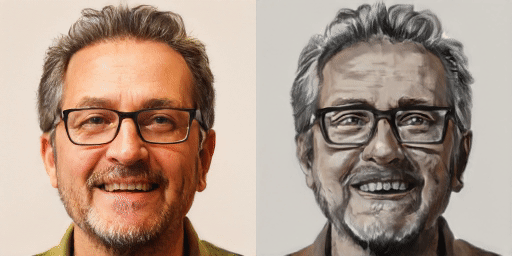
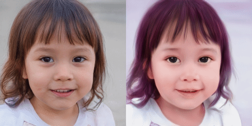

# Fix the Noise: Disentangling Source Feature for Controllable Domain Translation</sub>


**Fix the Noise: Disentangling Source Feature for Controllable Domain Translation**<br>
Dongyeun Lee, Jae Young Lee, Doyeon Kim, Jaehyun Choi, Jaejun Yoo, Junmo Kim<br>
https://arxiv.org/abs/2303.11545

>**Abstract**: 
*Recent studies show strong generative performance in domain translation especially by using transfer learning techniques on the unconditional generator. However, the control between different domain features using a single model is still challenging. Existing methods often require additional models, which is computationally demanding and leads to unsatisfactory visual quality. In addition, they have restricted control steps, which prevents a smooth transition. In this paper, we propose a new approach for high-quality domain translation with better controllability. The key idea is to preserve source features within a disentangled subspace of a target feature space. This allows our method to smoothly control the degree to which it preserves source features while generating images from an entirely new domain using only a single model. Our extensive experiments show that the proposed method can produce more consistent and realistic images than previous works and maintain precise controllability over different levels of transformation.*

## Requirements
Our code is highly based on the official implementation of [stylegan2-ada-pytorch](https://github.com/NVlabs/stylegan2-ada-pytorch). Please refer to [requirements](https://github.com/NVlabs/stylegan2-ada-pytorch#requirements) for detailed requirements.
* Python libraries:
```bash
pip install click requests tqdm pyspng ninja imageio-ffmpeg==0.4.3 lpips
```
* Docker users:
```bash
docker build --tag sg2ada:latest .
docker run --gpus all --shm-size 64g -it -v /etc/localtime:/etc/localtime:ro -v /mnt:/mnt -v /data:/data --name sg2ada sg2ada /bin/bash
```


## Pretrained Checkpoints
You can download the pre-trained checkpoints used in our paper:
| Setting                 |   Resolution  | Config   |    Description   |
| :--------------------   | :------------ | :------- | :--------------- |
| [FFHQ &rarr; MetFaces](https://drive.google.com/file/d/1Eo4T9KjkzRYdnENXgTpqIUOvaY4-SDeD/view?usp=sharing)    |    256x256    | paper256 | Trained initialized with official [pre-trained model on FFHQ 256](https://nvlabs-fi-cdn.nvidia.com/stylegan2-ada-pytorch/pretrained/transfer-learning-source-nets/) from Pytorch implementation of [stylegan2-ada-pytorch](https://github.com/NVlabs/stylegan2-ada-pytorch). |
| [FFHQ &rarr; AAHQ](https://drive.google.com/file/d/1GzM3icWaSOSGcKfYoidjEaloqc_MyAxX/view?usp=sharing)        |    256x256    | paper256 | Trained initialized with official [pre-trained model on FFHQ 256](https://nvlabs-fi-cdn.nvidia.com/stylegan2-ada-pytorch/pretrained/transfer-learning-source-nets/) from Pytorch implementation of [stylegan2-ada-pytorch](https://github.com/NVlabs/stylegan2-ada-pytorch). |
| [Church &rarr; Cityscape](https://drive.google.com/file/d/1YHa_g5xC_VM5MbHsr3VSfco1_PX1sRkA/view?usp=sharing) |    256x256    | stylegan2| Trained initialized with official [pre-trained model on LSUN Church config-f](https://nvlabs-fi-cdn.nvidia.com/stylegan2/networks/) from Tensorflow implementation of [stylegan2](https://github.com/NVlabs/stylegan2). |

## Datasets
We provide official dataset download pages and our processing code for reproducibility. You could alse use official processing code in [stylegan2-ada-pytorch](https://github.com/NVlabs/stylegan2-ada-pytorch#preparing-datasets). However, doing so does not guarantee reported performance.

**MetFaces**: Download the [MetFaces dataset](https://github.com/NVlabs/metfaces-dataset) and unzip it.
```bash
# Resize MetFaces
python dataset_resize.py --source data/metfaces/images --dest data/metfaces/images256x256
```
**AAHQ**: Download the [AAHQ dataset](https://github.com/onion-liu/aahq-dataset) and process it following original instruction.
```bash
# Resize AAHQ
python dataset_resize.py --source data/aahq-dataset/aligned --dest data/aahq-dataset/images256x256
```
**Wikiart Cityscape**: Download cityscape from [Wikiart](https://www.kaggle.com/datasets/ipythonx/wikiart-gangogh-creating-art-gan) and unzip it.

```bash
# Resize Wikiart Cityscape
python dataset_resize.py --source data/wikiart_cityscape/images --dest data/wikiart_cityscape/images256x256
```

## Train new networks using FixNoise
Using FixNoise, base command for training stylegan2-ada network as follows:

**FFHQ &rarr; MetFaces**
```bash
python train.py --outdir=${OUTDIR} --data=${DATADIR} --cfg=paper256 --resume=ffhq256 --fm=0.05
```
**FFHQ &rarr; AAHQ**
```bash
python train.py --outdir=${OUTDIR} --data=${DATADIR} --cfg=paper256 --resume=ffhq256 --fm=0.05
```
**Church &rarr; Cityscape**
```bash
python train.py --outdir=${OUTDIR} --data=${DATADIR} --cfg=stylegan2 --resume=church256 --fm=0.05
```
Additionally, we provide detailed [training scripts](./scripts/) used in our experiments.

## Demo
We provide noise interpolation example code in [jupyter notebook](./demo.ipynb).

#### FFHQ &rarr; MetFaces
 &nbsp;  \
 &nbsp;  

#### FFHQ &rarr; AAHQ
 &nbsp;  \
 &nbsp;  

#### Church &rarr; Cityscape
 &nbsp;  \
 &nbsp;  

## Citation
```
@inproceedings{lee2023fix,
  title   =   {Fix the Noise: Disentangling Source Feature for Controllable Domain Translation},
  author  =   {Lee, Dongyeun and Lee, Jae Young and Kim, Doyeon and Choi, Jaehyun and Yoo, Jaejun and Kim, Junmo},
  journal =   {Proceedings of the IEEE/CVF Conference on Computer Vision and Pattern Recognition},
  year    =   {2023}
}

```

## License
The majority of FixNoise is licensed under [CC-BY-NC](https://creativecommons.org/licenses/by-nc/4.0/), however, portions of this project are available under a separate license terms: all codes used or modified from [stylegan2-ada-pytorch](https://github.com/NVlabs/stylegan2-ada-pytorch) is under the [Nvidia Source Code License](https://nvlabs.github.io/stylegan2-ada-pytorch/license.html).
